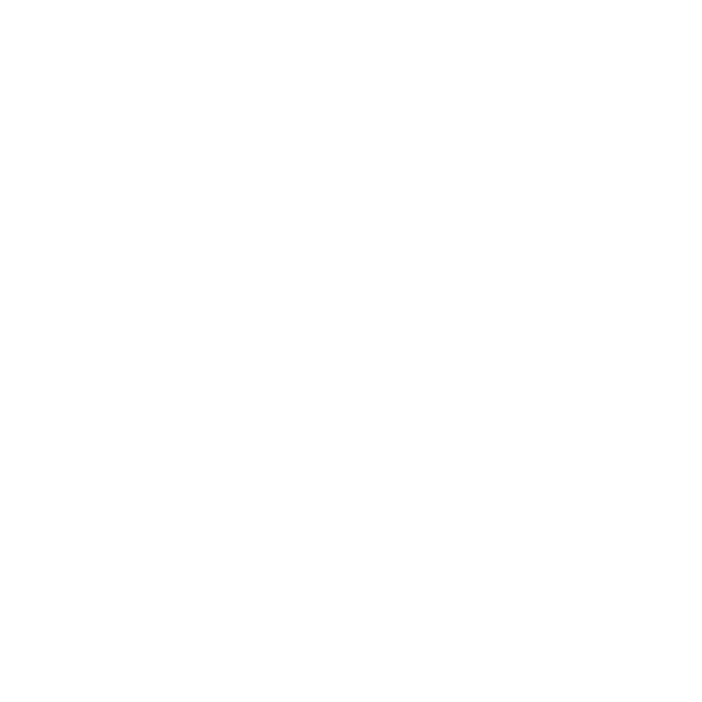

<p align="center">
  
</p>

# 🎮 OIKONO — Autonomous AI Game Master on Somnia

> **Universal AI Agent for Web3 Games. One import. Three lines of config. Infinite possibilities.**

[](https://somnia.network)
[](https://github.com/IrrhammCode/oikono)
[](https://soliditylang.org)
[](https://github.com/IrrhammCode/oikono)
[](https://opensource.org/licenses/MIT)

---

<p align="center">
  <em>🚀 OIKONO — Where AI meets On-Chain Game Economics</em>
</p>

---

## ⏱️ How OIKONO Works in 10 Seconds

OIKONO distills complex autonomous game mastering into a simple 5-step flow:

1. **Game emits events** (player actions, battles, trades) on-chain.
2. ↓ **Somnia Reactivity** detects events in the same block (MEV-resistant).
3. ↓ **AI Agent (Qwen3-30B)** reads game state and makes intelligent decisions.
4. ↓ **Plugins execute** — spawn enemies, adjust economy, generate quests, balance gameplay.
5. ↓ **Agent learns** from outcomes via on-chain memory. Gets smarter every cycle.

---

## ⚡ Quick Start

Get OIKONO running locally in under 60 seconds:

```bash
# 1. Clone the repository
git clone https://github.com/IrrhammCode/oikono.git
cd oikono

# 2. Install dependencies
npm install

# 3. Set up environment variables
cp .env.example .env
# Edit .env with your private key:
# PRIVATE_KEY=your_private_key_here

# 4. Compile smart contracts
npm run compile

# 5. Run tests
npm test

# 6. Run frontend
npm run dev
```

Open [http://localhost:9090](http://localhost:9090) in your browser.

---

## 🌍 Project Overview

**What is OIKONO?**
OIKONO is an autonomous AI agent system built on **Somnia Agentic L1** that brings intelligent, on-chain game mechanics to any Web3 game. It leverages Somnia's unique features: on-chain reactivity, LLM inference, and agent memory.

**Why does it exist?**
Web3 games lack intelligent automation. Game economies are static, enemies are predictable, and balancing requires manual intervention. OIKONO changes that — it's an AI Game Master that watches, learns, and acts autonomously.

**Who is it for?**
For Web3 game developers who want AI-powered game mechanics without building AI infrastructure from scratch. One import, three lines of code, and your game has an autonomous AI brain.

**How does it work?**
Games emit events → OIKONO detects them via Somnia's on-chain reactivity → AI analyzes and decides → Plugins execute actions → Agent learns from outcomes. All on-chain, all autonomous.

---

## 📂 Repository Structure & Component Documentation

OIKONO is highly modularized for maximum flexibility and composability:

| Component | Directory | Description |
|-----------|-----------|-------------|
| **Agent System** | [`/contracts/agents`](./contracts/agents) | AI agent brain, memory, knowledge base, plugins |
| **Agent Core** | [`/contracts/agents/core`](./contracts/agents/core) | Runtime, types, interfaces |
| **AI Plugins** | [`/contracts/agents/plugins`](./contracts/agents/plugins) | Spawn, Economy, Narrative, Balance plugins |
| **Agent Registry** | [`/contracts/agents/registry`](./contracts/agents/registry) | Agent registration and vault |
| **Game Contracts** | [`/contracts/game`](./contracts/game) | GameMaster, BattleArena, PlayerRegistry, EnemyNFT |
| **Economy** | [`/contracts/economy`](./contracts/economy) | Treasury, Rewards, Economy Params |
| **Tokens** | [`/contracts/tokens`](./contracts/tokens) | OIK Token (ERC-20 with burn tax) |
| **Utilities** | [`/contracts/utils`](./contracts/utils) | AntiSybil, CircuitBreaker, TWAP Oracle |
| **Examples** | [`/contracts/examples`](./contracts/examples) | SimpleRPG, SimpleStrategy demos |
| **Frontend** | [`/frontend`](./frontend) | Premium glass-morphism web interface |
| **Scripts** | [`/scripts`](./scripts) | Deployment and verification scripts |
| **Tests** | [`/test`](./test) | Comprehensive test suites |

---

## 🚨 Problem Statement

Web3 gaming faces critical automation and intelligence challenges:

- **Static Game Economies:** Reward rates, token burns, and inflation are hard-coded — no adaptation to player behavior.
- **Predictable Enemies:** NPCs and enemies follow fixed patterns, reducing replayability.
- **Manual Balancing:** Game developers manually adjust difficulty, economy, and content — slow and error-prone.
- **No Cross-Game Intelligence:** Each game is an isolated silo. No shared learning or knowledge transfer.
- **Bot Exploitation:** No intelligent detection of automated farming or Sybil attacks.
- **Delayed Reactions:** Game state changes require off-chain processing, creating MEV opportunities and delays.

---

## 💡 Solution

OIKONO completely reimagines game automation by combining on-chain AI with Somnia's unique capabilities:

- **On-Chain Reactivity:** React to game events in the same block via Somnia's reactive execution model.
- **LLM-Powered Decisions:** Qwen3-30B analyzes game state and makes intelligent decisions on-chain.
- **Agent Memory:** On-chain learning from past decisions — the agent gets smarter over time.
- **Dynamic NFTs:** AI-generated game entities (enemies, items, quests) as ERC-721 tokens.
- **Plugin Architecture:** Modular AI plugins (Spawn, Economy, Narrative, Balance) — enable what you need.
- **Cross-Game Knowledge:** Shared knowledge base allows intelligence transfer between games.
- **Anti-Sybil Protection:** Intelligent bot detection with cooldowns, stake minimums, and pattern analysis.

---

## 💎 Key Features

### 🧠 Autonomous AI Agent
- **On-chain LLM inference** via Somnia's native AI execution
- **Agent memory** — learns from decisions and outcomes
- **Knowledge base** — cross-game intelligence sharing
- **Prompt templates** — optimized for game-specific decisions

### ⚔️ AI Plugins
- **SpawnPlugin** — Generate enemies, NPCs, items with AI-determined stats
- **EconomyPlugin** — Dynamic reward rates, burn mechanisms, inflation control
- **NarrativePlugin** — AI-generated quests, dialogues, story events
- **BalancePlugin** — Automatic difficulty adjustment based on win rates

### 🎯 Game Integration
- **1 import, 3 lines of code** — minimal integration effort
- **Event-driven architecture** — just emit events, agent handles the rest
- **10+ game type templates** — RPG, Strategy, Racing, Puzzle, FPS, and more
- **60+ metrics tracked** — comprehensive game analytics

### 🛡️ Security
- **Circuit Breaker** — Emergency pause via guardian voting (3/5 required)
- **Anti-Sybil** — Cooldowns, stake minimums, unique opponent tracking
- **Burn Tax** — 0.5% on OIK transfers
- **Daily Reward Cap** — 2000 OIK per player per day

---

## ⚡ Somnia Integration — Deep Dive

OIKONO leverages Somnia's unique Agentic L1 features at **every layer** of the autonomous game mastering pipeline.

### 🔌 Somnia On-Chain Reactivity

Somnia's reactive execution model allows OIKONO to detect and respond to game events **in the same block** — eliminating MEV opportunities and reducing latency to zero.

```solidity
// GameReactor.sol — Entry point for games
abstract contract GameReactor is IGameStateReader {
    function onGameEvent(GameEvent memory event) internal {
        // Detected in the same block via Somnia reactivity
        _agent.processEvent(event);
    }
}
```

**Why Somnia Reactivity matters:**
- **Same-block response** — No waiting for next block, no MEV extraction
- **Event-driven** — Agent reacts to game events, not polling
- **Gas-efficient** — Only executes when something happens

### 🤖 Somnia LLM Inference

OIKONO uses Somnia's native LLM inference to run Qwen3-30B directly on-chain. The AI agent reads game state, analyzes patterns, and makes decisions — all within smart contract execution.

```solidity
// LLMInvoker.sol — On-chain LLM calls
contract LLMInvoker {
    function invokeLLM(string memory prompt) internal returns (string memory) {
        // Calls Somnia's native LLM execution
        return somniaLLM.execute(prompt);
    }
}
```

**LLM Use Cases:**
- Enemy stat generation based on player skill level
- Economy parameter adjustment based on market conditions
- Quest narrative generation based on player history
- Balance recommendations based on win/loss patterns

### 🧠 On-Chain Agent Memory

The agent stores its learning history on-chain via Somnia's storage model. Every decision, every outcome, every pattern — persisted for future reference.

```solidity
// AgentMemory.sol — On-chain learning
contract AgentMemory {
    struct Decision {
        bytes32 gameId;
        PluginType plugin;
        string reasoning;
        uint256 timestamp;
        int256 outcomeScore; // Set after observing results
    }

    function recordDecision(Decision memory d) external {
        decisions.push(d);
        _updatePatterns(d);
    }
}
```

**Memory Capabilities:**
- Decision history with outcome tracking
- Pattern detection across game sessions
- Cross-game knowledge transfer
- Confidence scoring for repeated patterns

### 🎨 Dynamic NFTs

AI-generated game entities are minted as ERC-721 tokens with on-chain metadata determined by the AI agent.

```solidity
// EnemyNFT.sol — AI-generated enemies
contract EnemyNFT is ERC721 {
    function mintEnemy(
        address player,
        string memory aiGeneratedStats
    ) external onlyAgent returns (uint256) {
        // Stats determined by AI based on player level, game state
        _mint(player, tokenId);
        _setTokenURI(tokenId, aiGeneratedStats);
    }
}
```

---

## 🏆 Hackathon Challenge Response: Somnia AI

OIKONO is engineered from the ground up to showcase **Somnia's Agentic L1 capabilities**. Here is exactly how we leverage every Somnia feature:

- **What:** An autonomous AI Game Master that uses Somnia's on-chain reactivity, LLM inference, and agent memory to bring intelligent game mechanics to any Web3 game.
- **Why:** To demonstrate that on-chain AI agents can make real-time, intelligent game decisions — not just follow pre-programmed rules.
- **Who:** Built for Web3 game developers who want AI-powered automation without off-chain infrastructure.
- **Where:** Operating entirely on Somnia L1 — reactivity, inference, and memory all on-chain.
- **When:** Real-time — agent reacts to game events in the same block they occur.
- **How:** By combining Somnia's reactive execution model with on-chain LLM inference and persistent agent memory.

<details>
<summary><b>🔎 Proof of Implementation (Somnia AI Integration)</b></summary>

*   **On-Chain Reactivity:** [`contracts/agents/GameReactor.sol`](./contracts/agents/GameReactor.sol) — Entry point using Somnia's reactive execution.
*   **LLM Integration:** [`contracts/agents/LLMInvoker.sol`](./contracts/agents/LLMInvoker.sol) — On-chain LLM inference via Qwen3-30B.
*   **Agent Memory:** [`contracts/agents/AgentMemory.sol`](./contracts/agents/AgentMemory.sol) — On-chain decision history and pattern learning.
*   **Knowledge Base:** [`contracts/agents/GameKnowledgeBase.sol`](./contracts/agents/GameKnowledgeBase.sol) — Cross-game intelligence storage.
*   **Plugin System:** [`contracts/agents/plugins/`](./contracts/agents/plugins) — Spawn, Economy, Narrative, Balance plugins.
*   **Dynamic NFTs:** [`contracts/game/EnemyNFT.sol`](./contracts/game/EnemyNFT.sol) — AI-generated enemy NFTs.

</details>

---

## 🎨 Screenshots

### 1. Landing Page
*Premium glass-morphism interface with real-time stats and particle effects.*
<!-- TODO: Add screenshot → save to `docs/screenshots/landing.png` -->
```
Route: /
What to capture: Hero section, features grid, how-it-works flow
```

### 2. Game Registration
*Register your game and configure AI plugins.*
<!-- TODO: Add screenshot → save to `docs/screenshots/register.png` -->
```
Route: /#register
What to capture: Registration form, game type selector, plugin toggles
```

### 3. Dashboard
*Real-time game metrics, AI suggestions, and pattern detection.*
<!-- TODO: Add screenshot → save to `docs/screenshots/dashboard.png` -->
```
Route: /dashboard
What to capture: Metrics charts, suggestion cards, pattern alerts
```

---

## 🏗️ Architecture Diagram

<p align="center">
  
</p>

```text
    [YOUR GAME]
      │ (Emit Events)
      ▼
 ┌─────────────────────────────────┐
 │   GameReactor.sol               │
 │   (1 import, 3 lines config)    │
 └─────────────────────────────────┘
           │
           ▼
 ┌─────────────────────────────────┐
 │   Somnia On-Chain Reactivity    │
 │   (Same-block detection)        │
 └─────────────────────────────────┘
           │
           ▼
 ┌─────────────────────────────────┐
 │   OikonoAgent.sol               │
 │   (The BRAIN)                   │
 └─────────────────────────────────┘
           │
     ┌─────┼─────┬─────────┐
     ▼     ▼     ▼         ▼
┌────────┐ ┌────────┐ ┌────────┐ ┌────────┐
│ Spawn  │ │Economy │ │Narrative│ │Balance │
│ Plugin │ │ Plugin │ │ Plugin │ │ Plugin │
└────────┘ └────────┘ └────────┘ └────────┘
     │         │         │         │
     ▼         ▼         ▼         ▼
┌────────────────────────────────────────┐
│   Somnia LLM Inference (Qwen3-30B)    │
│   + Agent Memory (On-Chain Learning)  │
└────────────────────────────────────────┘
           │
           ▼
 ┌─────────────────────────────────┐
 │   Game State Changes            │
 │   (Spawn NFTs, Adjust Economy,  │
 │    Generate Quests, Balance)    │
 └─────────────────────────────────┘
```

---

## 🎮 Integration Guide

### For Game Developers

**Step 1: Import GameReactor**
```solidity
import "@oikono/contracts/agents/GameReactor.sol";

contract MyGame is GameReactor {
    constructor() GameReactor("MyGame", GameType.RPG) {
        enablePlugin(AgentPlugin.SPAWN);
        enablePlugin(AgentPlugin.BALANCE);
    }
}
```

**Step 2: Emit Events**
```solidity
function move(uint256 x, uint256 y) external {
    emit PlayerMoved(msg.sender, x, y, xp, level);
    // Agent handles everything!
}

function battle(uint256 enemyId) external {
    emit BattleStarted(msg.sender, enemyId, playerPower);
    // AI determines outcome, rewards, and next enemy spawn
}
```

**Step 3: That's it!** The agent automatically:
- Detects game events via Somnia Reactivity
- Reads game state
- Makes AI-powered decisions
- Executes actions (spawn enemies, adjust economy, etc.)
- Learns from outcomes

### Supported Game Types

| Game Type | Metrics | Patterns | Templates |
|-----------|---------|----------|-----------|
| RPG | HP, XP, Level, Damage | Grief farming, Boss camping | Spawn, Economy, Narrative |
| Strategy | Resources, Units, Territory | Rush strategy, Turtle pattern | Economy, Balance |
| Racing | Speed, Lap time, Drift score | Rubber-banding, Track exploit | Balance |
| Puzzle | Score, Moves, Time | Solution farming, Difficulty cliff | Balance, Narrative |
| FPS | K/D, Accuracy, Win rate | Aim bot detection, Spawn camping | Balance, Spawn |
| Survival | Resources, Days, Crafting | Resource hoarding, Base camping | Economy, Spawn |
| Card Game | Win rate, Deck synergy | Meta stagnation, Card exploit | Balance, Narrative |
| Tower Defense | Waves cleared, Efficiency | Optimal path abuse | Spawn, Balance |
| Battle Royale | Placement, Kills, Survival | Hot drop pattern, Zone abuse | Balance, Spawn |
| Simulation | Economy, Population, Happiness | Economic exploit, Growth spam | Economy, Balance |

---

## 📊 Smart Contracts

### Agent System (`contracts/agents/`)
| Contract | Description |
|----------|-------------|
| `OikonoAgent.sol` | The BRAIN — autonomous AI agent with LLM integration |
| `AgentMemory.sol` | On-chain learning memory (decision history, patterns) |
| `GameKnowledgeBase.sol` | Cross-game knowledge base |
| `GameReactor.sol` | Entry point for games (1 import, 3 lines config) |
| `AgentRuntime.sol` | Plugin execution runtime |
| `LLMInvoker.sol` | On-chain LLM inference via Somnia |
| `PatternDetector.sol` | Anomaly and pattern detection |
| `SuggestionEngine.sol` | AI-powered suggestion generation |

### AI Plugins (`contracts/agents/plugins/`)
| Plugin | Description |
|--------|-------------|
| `SpawnPlugin` | Generate enemies, NPCs, items with AI-determined stats |
| `EconomyPlugin` | AI-driven economy management (rewards, burn, inflation) |
| `NarrativePlugin` | AI-generated quests, dialogues, story events |
| `BalancePlugin` | Automatic game balancing based on win rates |

### Game Contracts (`contracts/game/`)
| Contract | Description |
|----------|-------------|
| `GameMaster.sol` | Autonomous AI Game Master (Somnia Reactivity + LLM) |
| `BattleArena.sol` | Battle system with rewards |
| `PlayerRegistry.sol` | Player management |
| `EnemyNFT.sol` | AI-generated enemy NFTs (ERC-721) |

### Economy (`contracts/economy/`)
| Contract | Description |
|----------|-------------|
| `OIKToken.sol` | OIK token (ERC-20 with 0.5% burn tax) |
| `Treasury.sol` | Token burn and buyback |
| `RewardDistributor.sol` | Reward distribution with emission phases |
| `EconomyParams.sol` | Configurable economy parameters |

### Utilities (`contracts/utils/`)
| Contract | Description |
|----------|-------------|
| `AntiSybil.sol` | Anti-bot protection (cooldowns, stake minimum) |
| `CircuitBreaker.sol` | Emergency pause system (guardian voting) |
| `TWAPOracle.sol` | TWAP price oracle |

---

## 🧪 Testing

The project has comprehensive test coverage:

```bash
npm test
```

| Test Suite | Coverage |
|------------|----------|
| `AgentKit.test.js` | Agent runtime, plugins, registry |
| `CoreContracts.test.js` | CircuitBreaker, AntiSybil, BattleArena, Treasury |
| `OIKONO.test.js` | GameMaster, PlayerRegistry, EnemyNFT integration |
| `UniversalAgent.test.js` | OikonoAgent, AgentMemory, KnowledgeBase |

---

## 🚀 Deployment

### Deploy to Somnia Testnet

```bash
# Set your private key
export PRIVATE_KEY=your_private_key_here

# Deploy all contracts
npm run deploy:testnet

# Deploy universal agent (with full AI stack)
npm run deploy:agent
```

### Network Configuration

| Network | Chain ID | RPC |
|---------|----------|-----|
| Somnia Testnet | 50312 | `https://dream-rpc.somnia.network` |
| Somnia Mainnet | 5031 | `https://mainnet-rpc.somnia.network` |

### 📍 Deployed Contract Addresses (Somnia Testnet)

All contracts are deployed on **Somnia Testnet** (Chain ID: `50312`).

#### 🧠 Agent System

| Contract | Address | Source Code |
|----------|---------|-------------|
| **OikonoAgent** — The AI Brain | [`0x586e…7b05`](https://dream-explorer.somnia.network/address/0x586e9ACF26D76A1aD52054b3EF3e9c72A9917b05) | [`contracts/agents/OikonoAgent.sol`](./contracts/agents/OikonoAgent.sol) |
| **AgentRuntime** — Plugin execution engine | [`0x3ee2…7f54`](https://dream-explorer.somnia.network/address/0x3ee2954bd1e9188a35f40aFF521EF2a7FD375f54) | [`contracts/agents/core/AgentRuntime.sol`](./contracts/agents/core/AgentRuntime.sol) |
| **AgentMemory** — On-chain learning history | [`0xf464…4e327`](https://dream-explorer.somnia.network/address/0xf464e505278EC6aae80BCeAa5787DB1Ab284e327) | [`contracts/agents/AgentMemory.sol`](./contracts/agents/AgentMemory.sol) |
| **GameKnowledgeBase** — Cross-game intelligence | [`0x1B25…57c3`](https://dream-explorer.somnia.network/address/0x1B25C9FB0Ea6E09f773e082A6B30F39b091157c3) | [`contracts/agents/GameKnowledgeBase.sol`](./contracts/agents/GameKnowledgeBase.sol) |
| **LLMInvoker** — On-chain LLM inference | [`0x7b7a…53de`](https://dream-explorer.somnia.network/address/0x7b7a8B51348ef9e8D233775455D50ED7Daa653de) | [`contracts/agents/LLMInvoker.sol`](./contracts/agents/LLMInvoker.sol) |
| **PatternDetector** — Anomaly detection | [`0x655C…29eD`](https://dream-explorer.somnia.network/address/0x655Cd724318C38284B984A7629EFe05dE57F29eD) | [`contracts/agents/PatternDetector.sol`](./contracts/agents/PatternDetector.sol) |
| **SuggestionEngine** — AI suggestions | [`0xe43c…5f8c`](https://dream-explorer.somnia.network/address/0xe43c42e639170e5c88c2Ae242330473cf5745f8c) | [`contracts/agents/SuggestionEngine.sol`](./contracts/agents/SuggestionEngine.sol) |

#### 🔌 AI Plugins

| Contract | Address | Source Code |
|----------|---------|-------------|
| **SpawnPlugin** — AI enemy/NPC/item generation | [`0xBd4b…718AD`](https://dream-explorer.somnia.network/address/0xBd4bfbCefbF5d02B179003F48294768d4DF718AD) | [`contracts/agents/plugins/SpawnPlugin.sol`](./contracts/agents/plugins/SpawnPlugin.sol) |
| **EconomyPlugin** — Dynamic economy management | [`0xD70e…d8`](https://dream-explorer.somnia.network/address/0xD70e61cF38379B083a3d6bB4F7fbc5D61beF16d8) | [`contracts/agents/plugins/EconomyPlugin.sol`](./contracts/agents/plugins/EconomyPlugin.sol) |
| **NarrativePlugin** — AI quest/story generation | [`0x5CFD…286B`](https://dream-explorer.somnia.network/address/0x5CFDB6B8857EcBbB479105a43e68e5Ed2801286B) | [`contracts/agents/plugins/NarrativePlugin.sol`](./contracts/agents/plugins/NarrativePlugin.sol) |
| **BalancePlugin** — Auto game balancing | [`0x2041…8ACF`](https://dream-explorer.somnia.network/address/0x204173426d223F4ca1dd6FFb20492Ae316A88ACF) | [`contracts/agents/plugins/BalancePlugin.sol`](./contracts/agents/plugins/BalancePlugin.sol) |

#### 🎮 Game Contracts

| Contract | Address | Source Code |
|----------|---------|-------------|
| **GameMaster** — Autonomous AI Game Master | [`0x40E8…7347`](https://dream-explorer.somnia.network/address/0x40E8b775490b3BbB87A30693024E80fbF3D87347) | [`contracts/game/GameMaster.sol`](./contracts/game/GameMaster.sol) |
| **BattleArena** — PvP battle system | [`0x12EA…d3Cf`](https://dream-explorer.somnia.network/address/0x12EA4e91489B4FF6089C55a3833fc2e9b035d3Cf) | [`contracts/game/BattleArena.sol`](./contracts/game/BattleArena.sol) |
| **PlayerRegistry** — Player management | [`0xA530…70Ae`](https://dream-explorer.somnia.network/address/0xA530dbDB02f46F4A1B7c18cEE8eA57148fC470Ae) | [`contracts/game/PlayerRegistry.sol`](./contracts/game/PlayerRegistry.sol) |
| **EnemyNFT** — AI-generated enemy NFTs | [`0x8B0E…037`](https://dream-explorer.somnia.network/address/0x8B0E52280c2E5047B8fd7AffD20333f36463b037) | [`contracts/game/EnemyNFT.sol`](./contracts/game/EnemyNFT.sol) |

#### 💰 Economy

| Contract | Address | Source Code |
|----------|---------|-------------|
| **OIKToken** — ERC-20 with 0.5% burn tax | [`0xA039…2116`](https://dream-explorer.somnia.network/address/0xA03916C493cc00869FBd1D56cb89ba0d14A12116) | [`contracts/tokens/OIKToken.sol`](./contracts/tokens/OIKToken.sol) |
| **Treasury** — Token burn & buyback | [`0xa93F…F7C7`](https://dream-explorer.somnia.network/address/0xa93F8194Aa25610eF1a818745e3f9f7FEcE1F7C7) | [`contracts/economy/Treasury.sol`](./contracts/economy/Treasury.sol) |
| **RewardDistributor** — Emission phases | [`0x7017…7Db9`](https://dream-explorer.somnia.network/address/0x7017a844a4A9b2094C2D6e0252b9a441c2387Db9) | [`contracts/economy/RewardDistributor.sol`](./contracts/economy/RewardDistributor.sol) |
| **EconomyParams** — Configurable parameters | [`0x6956…4235`](https://dream-explorer.somnia.network/address/0x6956F4485cAA6d84E2f4f210679AbbF416604235) | [`contracts/economy/EconomyParams.sol`](./contracts/economy/EconomyParams.sol) |

#### 🛡️ Utilities

| Contract | Address | Source Code |
|----------|---------|-------------|
| **CircuitBreaker** — Emergency pause (guardian voting) | [`0xA81C…7223`](https://dream-explorer.somnia.network/address/0xA81CC9ee929384ac20a9351DCC999E2e32F67223) | [`contracts/utils/CircuitBreaker.sol`](./contracts/utils/CircuitBreaker.sol) |
| **AntiSybil** — Anti-bot protection | [`0x96A9…4bd3`](https://dream-explorer.somnia.network/address/0x96A9C1436C98155870bA29F5fD3637cbaC7f4bd3) | [`contracts/utils/AntiSybil.sol`](./contracts/utils/AntiSybil.sol) |
| **TWAPOracle** — TWAP price oracle | [`0x1dcE…18b6`](https://dream-explorer.somnia.network/address/0x1dcEC3807fca337f54C81cDe01985594427F18b6) | [`contracts/utils/TWAPOracle.sol`](./contracts/utils/TWAPOracle.sol) |

#### 🏭 Game Factory

| Contract | Address | Source Code |
|----------|---------|-------------|
| **GameFactory** — Deploy new games | [`0x248c…9007`](https://dream-explorer.somnia.network/address/0x248cCDBB7331cA30D4057862F4Dc673a6AeC9007) | [`contracts/GameFactory.sol`](./contracts/GameFactory.sol) |

#### 🎯 Registered Games (via Factory)

| Game | Type | Address |
|------|------|---------|
| WagerVerse Arena | PvP | [`0xd5f3…d182`](https://dream-explorer.somnia.network/address/0xd5f3E959b213e1B6811852bB7F4Ea8a5C868e21c) |
| Worms Arena | Strategy | [`0x01Bc…D182`](https://dream-explorer.somnia.network/address/0x01BcdC8eD5Ac27Fe0dFF13c71EEE7e4B2c23D182) |
| Infinite Craft | Sandbox | [`0xeb6c…40e2`](https://dream-explorer.somnia.network/address/0xeb6c713Fd7292ced58fa13eEf3DBd5c9Dfdb40e2) |
| Void Hunters | RPG | [`0xccbF…Daf0`](https://dream-explorer.somnia.network/address/0xccbFe6Cb15E50CB540BB3dcbeBd0333564C1Daf0) |
| Kingsomni | Card | [`0x9839…fB12`](https://dream-explorer.somnia.network/address/0x9839E260f5C10e1fd975214bDdd498a8D39FcB12) |
| Gamers Lab | Puzzle | [`0x197B…F4B4`](https://dream-explorer.somnia.network/address/0x197B377E88f7EbB0Dd130a1c2EAC40193930F4B4) |
| Somn Tournament | Racing | [`0x04cd…2912`](https://dream-explorer.somnia.network/address/0x04cdcC114616F37bA1D1CcC4f5248DbB2E782912) |
| NFT Bridge World | Simulation | [`0x098f…926`](https://dream-explorer.somnia.network/address/0x098f6C6B1c80460aD896F63900D84D4e64BFA926) |
| DeFi Arena | DeFi | [`0x9532…86F8`](https://dream-explorer.somnia.network/address/0x9532A3Ac3a3ba2AAcbc6bbd21ede6dDED49d86F8) |

### Post-Deployment

After deployment, update `frontend/config.js` with the deployed contract addresses:

```javascript
const CONFIG = {
  CONTRACTS: {
    OikonoAgent: '0x586e9ACF26D76A1aD52054b3EF3e9c72A9917b05',
    AgentRuntime: '0x3ee2954bd1e9188a35f40aFF521EF2a7FD375f54',
    // ... other addresses
  }
};
```

---

## 📁 Project Structure

```
oikono/
├── contracts/                  # Solidity smart contracts
│   ├── agents/                 # AI agent system
│   │   ├── core/               # Runtime, types, interfaces
│   │   ├── plugins/            # Spawn, Economy, Narrative, Balance
│   │   └── registry/           # Agent registration and vault
│   ├── game/                   # Game contracts (GameMaster, BattleArena)
│   ├── economy/                # Token economics (Treasury, Rewards)
│   ├── tokens/                 # OIK Token (ERC-20)
│   ├── utils/                  # AntiSybil, CircuitBreaker, TWAP
│   └── examples/               # SimpleRPG, SimpleStrategy demos
├── frontend/                   # Premium glass-morphism web interface
├── scripts/                    # Deployment and verification scripts
├── test/                       # Comprehensive test suites
├── docs/                       # Documentation
├── hardhat.config.js           # Hardhat configuration
├── package.json                # Dependencies and scripts
└── .env.example                # Environment variable template
```

---

## 🔗 Links

- [Somnia Network](https://somnia.network)
- [Somnia Documentation](https://docs.somnia.network)
- [GitHub Repository](https://github.com/IrrhammCode/oikono)

---

## 📄 License

MIT License — see [LICENSE](./LICENSE) for details.

---

<p align="center">
  <em>Built with ⚙️ by <a href="https://github.com/IrrhammCode">Irham</a> — 4x International Hackathon Winner</em>
</p>
